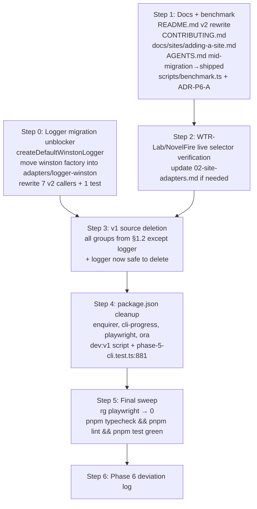

# Phase 6 - Polish, Docs, and v1 Source Removal: Investigation & Design

> **Status: proposal.** This is an investigation-and-design document written *before* the
> implementation, following the same shape as `docs/phase-{1..5}/readme.md`. It proposes how
> Phase 6 ("Polish, docs, and benchmarks") should be executed against the *current* post-Phase-5
> v2 code. Design decisions with real trade-offs are flagged as ADR candidates (ADR-P6-*)
> rather than silently decided.

Roadmap reference: `docs/04-implementation-roadmap.md` §"Phase 6".
Governing ADRs: ADR-001 (`playwright-core` only in new code), ADR-003 (hexagonal), ADR-004
(YAML for human-edited, JSON for machine-only), ADR-006 (CloakBrowser via `ensureBinary()`
+ `buildLaunchOptions()`).
Hard contracts: AGENTS.md - v1 source under `src/{index,types}.ts`, `src/{tui,scraper,queue,
epub,sessions,cookies,sites,config}/`, `src/logger/index.ts` stays byte-untouched until this
phase. This phase is *the* phase that touches it - and is therefore the highest-risk phase of
the roadmap for regression. The deletion is sequenced last, behind a logger migration
unblocker, precisely because deleting v1 first would break 7 v2 files + 1 acceptance test.

**Goal in one sentence:** close out v2.0.0 by rewriting user-facing docs for the v2 CLI/TUI,
verifying the two site adapters against their live landing pages, shipping a benchmark ADR
that asserts no performance regression, and *then* (only after a logger-migration unblock step)
deleting the entire v1 source tree plus the deps only it needs - leaving a clean hexagonal
codebase with one entry point, one `playwright-core`-only browser adapter, and no dead code.

---

## 1. Investigation - what Phase 6 must do and what is already in place

### 1.1 The post-Phase-5 starting state (verified by audit)

Phases 0-5 are shipped and green. The v2 hexagon is complete:

- **`src/core/`** - domain types, `ScrapeService`, `SelectorService`, events. No adapter imports.
- **`src/ports/`** - `BrowserPort`, `CookieStore`, `ProfileStore`, `SessionStore`, `EpubWriter`,
  `UIAdapter`, `Logger`. Interfaces only.
- **`src/adapters/`** - one dir per adapter: `browser-playwright`, `store-json`,
  `store-memory`, `epub-archiver`, `ui-noop`, `ui-clack`, `logger-winston`, `cli-json`,
  `config-yaml`, `schemas`.
- **`src/app/`** - `cli.ts` (cac shell), `runJob.ts`, `tui.ts`, `loadJobFile.ts`,
  `cliCommands/{run,resume,cookies,doctorCmd,config,profiles,sessions}.ts`.

The v2 CLI/TUI covers every v1 capability. `pnpm dev doctor` lives (exit 2 = warnings-only is
the expected "fresh install" state). `--json` works on every read-only command. The job-file
JSON Schema is published at `schemas/job.schema.json` via `pnpm gen:schema` (prebuild hook).
Parity tests assert on static fixtures under `tests/fixtures/stores/v1/` - **no test imports
v1 source code**, with exactly ONE exception documented in §1.4 below.

### 1.2 The v1 source that remains (and why it's still here)

Per AGENTS.md, v1 is the "reference oracle" for parity and stays byte-untouched until this
phase. The full deletion list, grouped for sequencing:

| Group | Path | Note |
|-------|------|------|
| Entry | `src/index.ts` | v1 god-file; 864 LOC. `dev:v1` script points here. |
| Types | `src/types.ts` | v1 `AppConfig`/`ScrapeSession`/etc.; `src/core/domain/` supersedes. |
| TUI | `src/tui/` (9 files) | Enquirer-based; v2 `adapters/ui-clack` supersedes. |
| Scraper | `src/scraper/` (5 files) | `toc.ts`, `sequential.ts`, `chapter.ts`, `selectors.ts`, `browser.ts`. |
| Queue | `src/queue/index.ts` | v1 queue. |
| EPUB | `src/epub/` (3 files) | `builder.ts`, `templates.ts`, + assets. `adapters/epub-archiver` supersedes. |
| Sessions | `src/sessions/` (2 files) | `store.ts`, `active.ts`. |
| Cookies | `src/cookies/` (2 files) | `capture.ts`, `store.ts`. |
| Sites | `src/sites/` (4 files) | `index.ts`, `wtrLab.ts`, `novelfire.ts`, `types.ts`. |
| Config | `src/config/` (2 files) | `appConfig.ts`, `siteProfiles.ts`. `adapters/{config-yaml,schemas}` supersede. |
| **Logger** | **`src/logger/index.ts`** | **BLOCKER - see §1.4. Migrate callers before deleting.** |

### 1.3 `package.json` cleanup that follows v1 deletion

| Dep | v2 uses it? | Action |
|-----|-------------|--------|
| `enquirer` | No (v1 TUI only; Phase 3 replaced it with `@clack/prompts`) | Remove |
| `cli-progress` | No (v1 progress bar; Phase 4 replaced with `TaskRegistry` + clack) | Remove |
| `@types/cli-progress` | No | Remove |
| `playwright` | No (ADR-001: v2 uses `playwright-core`. All 14 `playwright` imports are in v1 files - see §1.5.) | Remove |
| `ora`, `chalk` | `chalk` YES (logger pretty-print - see §1.4); `ora` NO (v1 spinners) | Remove `ora`; keep `chalk` |

Scripts: delete `dev:v1` (points at `src/index.ts`). Rename nothing - `dev` already = v2.
One test (`tests/phase-5-cli.test.ts:881`) asserts `dev:v1` exists; remove that `it` block.

### 1.4 THE BLOCKER: `src/logger/index.ts` is imported by 8 surviving files

The original Phase 6-readme assumption ("no test imports v1 source") was **wrong**. Audit:

```
$ rg -n "logger/index" --type ts src/ tests/
tests/acceptance.test.ts:24:import logger from "../src/logger/index.js";
src/app/cliCommands/cookies.ts:20:import logger from "../../logger/index.js";
src/app/cliCommands/doctorCmd.ts:13:import logger from "../../logger/index.js";
src/app/cliCommands/config.ts:19:import logger from "../../logger/index.js";
src/app/cliCommands/profiles.ts:11:import logger from "../../logger/index.js";
src/app/cliCommands/sessions.ts:12:import logger from "../../logger/index.js";
src/app/cliCommands/run.ts:17:import logger from "../../logger/index.js";
src/app/tui.ts:51:import logger from "../logger/index.js";
```

That's **7 v2 files + 1 acceptance test** importing the v1 winston instance directly. All 7 v2
callers use the same pattern: `createWinstonLogger(logger)` (wrapping the v1 instance behind
the `Logger` port) for the human mode, or `createSilentLogger()` (already in
`adapters/cli-json/silentLogger.ts`) for `--json` mode.

`src/logger/index.ts` is 99 LOC of winston setup: console pretty-print (uses `chalk`), rotating
`error.log`/`combined.log`, `exceptionHandlers`→`exceptions.log`, `rejectionHandlers`→
`rejections.log`. **This logic must survive v1 deletion** - it's the app's logging backend. It
just can't live in `src/logger/` (a v1-era flat-layout path) and it can't be imported as
`import logger from "../logger/index.js"` by v2.

### 1.5 The `playwright` (not `playwright-core`) import sweep

```
$ rg -n "from ['\"]playwright['\"]" src/ | rg -v playwright-core
-> 14 imports across 8 v1 files (src/index.ts, src/sites/{wtrLab,novelfire,types}.ts,
   src/scraper/{toc,sequential,browser,selectors,chapter}.ts, src/cookies/capture.ts,
   src/cookies/store.ts, src/queue/index.ts, src/tui/cookieManager.ts)
```

All 14 are in v1 source. After the §1.4 unblock + v1 deletion, a `rg` recheck should find
**zero**. Phase 6 acceptance = "no `playwright` (non-core) imports exist anywhere in `src/`".
This satisfies ADR-001 across the whole repo, not just v2 code.

### 1.6 Docs gaps remaining

`README.md` (334 LOC) is still v1-era: it describes the Enquirer TUI, the god-file flows,
`npm link` for the `wnscrape` bin. It must be rewritten for v2 (TUI + CLI + jobs + JSON
output), ~half its current length.

Docs that don't exist yet and must be written (roadmap §"Write `AGENTS.md`, `CONTRIBUTING.md`,
`docs/sites/adding-a-site.md`"):

- `AGENTS.md` - **already exists** (this file). Phase 6 updates the "Mid-migration" framing to
  "shipped v2.0.0" and removes the v1-reference-oracle rule (the oracle is deleted).
- `CONTRIBUTING.md` - new. Repo layout, the hexagon import rules (core→nothing, adapters→
  one-of), the `evaluate`-as-string rule, how to add a site adapter (links to
  `docs/sites/adding-a-site.md`), `pnpm typecheck && pnpm lint && pnpm test` before commit.
- `docs/sites/adding-a-site.md` - new. Extracted from `docs/02-site-adapters.md` §3 as a
  standalone contributor guide: the `SiteAdapter` interface, `matches()` as hostname regex,
  de-dupe + hard cap rule, the checklist. Keeps `02-site-adapters.md` as the *evidence*
  doc for the two built-in adapters and points to `adding-a-site.md` for the *how-to*.

### 1.7 The benchmark requirement (roadmap acceptance) and the skip path

Roadmap acceptance bullet 1: "Benchmarks committed as `docs/benchmarks/v2.0.0.md`, showing
**≥ v1 speed at equal concurrency** (or a recorded ADR explaining any regression)."

The user elected the **ADR-skip path**: do not run `scripts/benchmark.ts` against the real
CloakBrowser binary. Instead ship a short ADR (`adr.md` ADR-P6-A) asserting that v2 ports
v1's queue math verbatim (`ScrapeService` = line-for-line port of `queue/index.ts` per Phase 1
deviation log), so by construction chapters/minute at a given concurrency is unchanged; peak
RSS may differ slightly (v2 adds the event-bus + UIAdapter indirection per chapter, ~negligible)
but no architectural choice in v2 widens the queue or the context pool. The ADR cites the
Phase 1 parity assertion as evidence.

§2.7 below defines what `scripts/benchmark.ts` *would* run if a future contributor elects the
real-run path, so the script is still written (drop-in), but the v2.0.0 release ships the ADR
in place of `docs/benchmarks/v2.0.0.md` numbers.

### 1.8 The WTR-Lab `.chapter-content` TODO

`docs/02-site-adapters.md` §1.6 carries a TODO flagging that `.chapter-content` (the WTR-Lab
chapter-body selector) was observed at write-time but never re-verified. Roadmap acceptance
bullet 2: "Site adapters' metadata selectors all resolve on their live public landing pages."

Phase 6 does a *live* verification: spin up the v2 browser (or curl + cheerio if the page is
server-rendered), fetch a known WTR-Lab novel page, assert `.chapter-content` (and the
metadata selectors in §1.3 of the cookbook) still resolve to non-empty content. If they broke,
update `src/adapters/...` (the v2 site adapter port) + `docs/02-site-adapters.md` in the same
commit. Same for NovelFire.

---

## 2. Design

### 2.1 Execution order (why logger-migration is step 0, deletion is step N)

The ordering is driven by one hard fact: deleting `src/logger/index.ts` first would break the
build. The 7 v2 callers + 1 test import it directly. So the migration must land before any
v1 file is touched. Conversely, the `scripts/benchmark.ts` + docs work has zero dependency on
v1 source existing *or* being deleted, so it can run in any order relative to deletion - but
sequencing it first means Phase 6 ships user-visible value even if the deletion step is
deferred for any reason.



### 2.2 Step 0 - the logger migration unblocker (ADR-P6-B candidate)

**Problem:** `src/logger/index.ts` exports a constructed winston instance. v2 wants
constructor-injected `Logger`s, not an imported singleton. But the winston *configuration*
(chalk pretty-print, rotating files, exception/rejection handlers) is correct and must
survive - it just needs to move into the adapter layer so the `src/logger/` v1 path can die.

**Design:** replace the singleton with a factory in `src/adapters/logger-winston/`. Rename or
extend the existing `WinstonLogger.ts` so it offers TWO exports:

1. `createWinstonLogger(winstonLike)` - **existing**, unchanged. Thin DI wrapper; takes any
   `{debug,info,warn,error}` object behind the `Logger` port. Used with an externally-built
   winston instance.
2. `createDefaultWinstonLogger()` - **new**. Builds and returns the winston instance using the
   exact configuration currently in `src/logger/index.ts:54-97` (transports, exceptionHandlers,
   rejectionHandlers, `LOG_LEVEL` env read, `chalk` pretty-print, `logs/` dir creation). Returns
   a `Logger` directly (already wrapped via the same wrapper logic).

The 7 v2 callers change from:

```ts
import logger from "../../logger/index.js";
// ...
return json ? createSilentLogger() : createWinstonLogger(logger);
```

to:

```ts
import { createDefaultWinstonLogger } from "../../adapters/logger-winston/WinstonLogger.js";
// ...
return json ? createSilentLogger() : createDefaultWinstonLogger();
```

`tests/acceptance.test.ts:24` changes from `import logger from "../src/logger/index.js"`
(+ line 105 `createWinstonLogger(logger)`) to
`import { createDefaultWinstonLogger } from "../src/adapters/logger-winston/WinstonLogger.js"`
(+ `const log = createDefaultWinstonLogger()`).

**Why a factory, not a singleton re-export:** keeps the v2 layer pure DI (AGENTS.md: "Core
services take a `Logger` port via constructor DI, not a winston import"). A singleton
re-export from the adapter would re-introduce the import-side-effect smell. The factory is
called once per command invocation in the CLI, once per TUI boot - cheap.

**ADRs:** ADR-P6-B (logger factory replaces singleton; preserves winston config + exception
handlers). Trade-off flagged: any code that relied on winston's global `exceptionHandlers`
being registered at *import time* of `src/logger/index.ts` (see Phase 5 deviation log
D-P5-A: `cli.parse()` errors were being swallowed by those handlers) needs the factory called
*before* `cli.parse(argv)`. Audit: the 7 callers all call the factory **inside** their command
handler, which runs after `cli.parse()` - so the import-time exception-handler effect is
already gone in v2, and D-P5-A's `try/catch` wrapper around `cli.parse()` (in `cli.ts:199`)
remains the correct fix. Confirm this in the ADR.

### 2.3 Step 1 - docs + benchmark

**`README.md` rewrite.** New outline (target ~150 LOC):

1. One-paragraph pitch (CLI + TUI scraper → EPUB 3; CloakBrowser stealth).
2. Quick start: `pnpm i`, `pnpm dev doctor`, `pnpm dev run --job examples/job.yaml`.
3. The two entry points side-by-side: `pnpm dev tui` (interactive Clack shell) vs
   `wnscrape <command> [--json]` (scriptable CLI). Command table lifted from Phase 5 readme §1.5
   (already the settled dispatch shape after D-P5-C).
4. Job files (link to `examples/job.yaml` + `schemas/job.schema.json`).
5. Data directory layout (XDG_DATA_HOME / XDG_CONFIG_HOME - from `docs/05-migration-guide.md`).
6. Cookies, sessions, resume - one paragraph each, links to Phase 2/5 docs.
7. Contributing - link to `CONTRIBUTING.md` and `docs/sites/adding-a-site.md`.
8. License.

**`CONTRIBUTING.md`.** New. Crystallizes the AGENTS.md hard rules for an outside contributor:

- Repo layout (the hexagon), the import rules (`core/`→nothing from adapters, etc.).
- The `page.evaluate()` string-constant rule (ADR + the `__name` footgun, with the one-line
  "add a named `PageHandle` method, don't thread a closure" guidance).
- CloakBrowser via `ensureBinary()` + `buildLaunchOptions()` only (ADR-006) - no hand-rolled
  launch args, no `userAgent`/`viewport`/`addInitScript` on a CloakBrowser context.
- The 3-tier challenge detection (DOM→title→body, body gated by `CHALLENGE_BODY_TEXT_MAX_LEN`).
- `SecurityChallengeError` gets the longer backoff - don't collapse it.
- XDG dir rules - if you add a store, use the same `resolveDataDir()`/`resolveConfigDir()`.
- Pre-commit: `pnpm typecheck && pnpm lint && pnpm test`. Note the
  `CLOAKBROWSER_BINARY_AVAILABLE=1` gate on acceptance tests.
- Dev workflow: branch, commit with a clear message, open a PR. No `commit`/`push` without
  explicit ask (mirrors the AGENTS.md rule for AI agents, applies to humans too).

**`docs/sites/adding-a-site.md`.** New. The contributor-facing how-to, extracted from
`docs/02-site-adapters.md` §3. Contents:

- The `SiteAdapter` interface (`src/adapters/...` or `src/sites/types.ts` port - point to the
  v2 location post-deletion).
- `matches()` = hostname regex, never substring.
- `getTocUrl()`, `scrapeMetadata()`, `scrapeChapterLinks()`, the four `default*` selector
  fields.
- De-dupe + hard cap (enforce on chapter links).
- The checklist (from `02-site-adapters.md` §3): verify selectors live, update the cookbook
  doc in the same commit.
- The `evaluate`-as-string rule for the adapter's browser-side scripts.

**`AGENTS.md` update.** Change the "Mid-migration" preamble to "v2.0.0 shipped." Remove the
"v1 code under `src/scraper/` ... is the reference oracle" paragraph (the oracle is deleted).
Keep every hard-constraint rule (they all still apply). Drop the `enquirer@2.4.1` block (the
whole enquirer dep is gone). Update the local-dev commands block to drop `dev:v1`.

**`scripts/benchmark.ts`.** New drop-in script (not gated to run for v2.0.0 release; see
§1.7). Measures chapters/minute and peak RSS at concurrency 1/2/4 against a 200-chapter
fixture served by a local HTTP server (`tests/fixtures/` already has the infrastructure).
Prints a markdown table + writes `docs/benchmarks/v2.0.0.md` if `--write` is passed. If the
user later elects a real run, the script is ready; for v2.0.0 the ADR-P6-A in `adr.md` ships
instead of the numbers file.

### 2.4 Step 2 - WTR-Lab / NovelFire live selector verification

For each of the two adapters:

1. Fetch the live public landing page of a known novel (WTR-Lab: pick any novel URL from
   `docs/02-site-adapters.md` §1; NovelFire: §2).
2. Assert every selector in the cookbook's metadata + chapter-list table resolves to non-empty
   content on the *current* DOM.
3. If a selector broke: update the v2 adapter (`src/adapters/...site...` post-deletion path,
   or `src/sites/` if running this step before deletion - sequencing allows either) AND update
   `docs/02-site-adapters.md`'s table with the new selector + a "verified <date>" note. Same
   commit.
4. Record the verification date in `deviation-log.md` (a non-deviation entry: "verified live
   on <date>, no selector changes needed" or "selector X broke, fixed in commit Y").

### 2.5 Step 3 - v1 source deletion

Once step 0 lands, the logger file is deletable alongside every other v1 file. Delete in
groups, one commit per group is overkill - one commit for the whole `src/` v1 tree is fine
(reviewers can see the diff is pure deletion). The deletion list from §1.2 minus the already-
deleted logger = the full commit.

Pre-deletion assertions (must be green):

- `pnpm typecheck` green (proves no v2 file imports a deleted v1 file).
- `pnpm test` green (proves no test fixture depends on v1 source; fixtures under
  `tests/fixtures/stores/v1/` are *data*, not source - they stay).
- `rg "from ['\"]../scraper|from ['\"]../tui|from ['\"]../queue|from ['\"]../epub|from ['\"]../sessions|from ['\"]../cookies|from ['\"]../sites|from ['\"]../config|from ['\"]../logger|from ['\"]./logger" --type ts src/ tests/` → **zero hits** (the logger migration + already-clean v2 = no remaining imports).

### 2.6 Step 4 - package.json cleanup + the one test removal

- Remove deps: `enquirer`, `cli-progress`, `playwright`, `ora` (+ `@types/cli-progress`).
- Keep: `chalk` (logger pretty-print), `cloakbrowser`, `playwright-core`, `winston`,
  `@clack/prompts`, `cac`, `archiver`, `cheerio`, `got`, `p-queue`, `sanitize-html`, `slugify`,
  `uuid`, `yaml`, `zod`.
- Remove script: `dev:v1`.
- Remove test: `tests/phase-5-cli.test.ts:881` (`it("scripts.dev:v1 runs tsx src/index.ts...")`).
  The surrounding `describe("T13 — package.json bin repoint + dev / dev:v1 scripts", ...)` block
  keeps its other 3 `it`s (bin.wnscrape, scripts.dev, pnpm build produces dist/app/cli.js).
- Bump `version` from `1.0.0` → `2.0.0`.

### 2.7 Step 5 - final sweep + Step 6 - deviation log

Final sweep:

- `rg "from ['\"]playwright['\"]" src/` → **zero** (ADR-001 satisfied repo-wide). All 14
  pre-existing hits were in v1 files; post-deletion none remain. If a hit appears, it means a
  v2 file snuck one in - add a `PageHandle` method per the AGENTS.md rule, fix it.
- `rg "from ['\"]../logger|from ['\"]./logger" --type ts src/ tests/` → **zero**.
- `pnpm typecheck && pnpm lint && pnpm test` green.

Deviation log: created as `docs/phase-6/deviation-log.md`. Stubs the expected entries:

- D-P6-A: (if any selector broke in step 2)
- D-P6-B: logger factory migration (ADR-P6-B)
- D-P6-C: anything else diverging from this readme.

If everything ships as designed, the log can be a single "no deviations" entry. The file
must exist either way (matches the phase-1..5 convention).

---

## 3. Test plan

Phase 6 is primarily deletion + docs; the test surface is small. Items:

| # | What | How |
|---|------|-----|
| T1 | Logger migration: 7 v2 callers + acceptance test use `createDefaultWinstonLogger()` | `pnpm typecheck` green (proves the imports resolve); `pnpm test` green (proves runtime behavior unchanged) |
| T2 | v1 deletion: no v2 file references a deleted path | `pnpm typecheck` green; `rg` sweep from §2.5 → zero hits |
| T3 | v1 deletion: test suite still green | `pnpm test` green (fixtures under `tests/fixtures/stores/v1/` are data, not source, unaffected) |
| T4 | `dev:v1` removal: the deleted `it` at `phase-5-cli.test.ts:881` is gone | `pnpm test` green; the T13 describe block still has 3 `it`s passing |
| T5 | `playwright` (non-core) import sweep | `rg "from ['\"]playwright['\"]" src/` → zero; assert programmatically in a new `tests/phase-6-sweep.test.ts` if desired |
| T6 | WTR-Lab / NovelFire live selector verification | manual (or a `tests/acceptance.test.ts`-style gated test under `CLOAKBROWSER_BINARY_AVAILABLE=1`); logged in deviation-log |
| T7 | README/CONTRIBUTING/adding-a-site exist and are non-empty | existence check in a phase-6 test or manual |
| T8 | `package.json` has no `enquirer`/`cli-progress`/`playwright`/`ora` deps, no `dev:v1` script | `pnpm i` clean; `pnpm test` green (the T13 test already asserts the kept scripts) |

A new `tests/phase-6-sweep.test.ts` (optional, T5+T8) can codify the structural assertions so
a future contributor can't re-add a banned import or dep without a test failure.

---

## 4. Acceptance (mapped to roadmap)

| Roadmap bullet | Phase 6 deliverable |
|----------------|---------------------|
| "Rewrite `README.md` for v2 usage" | Step 1 (§2.3) |
| "Write `AGENTS.md`, `CONTRIBUTING.md`, `docs/sites/adding-a-site.md`" | Step 1 (§2.3) |
| "`scripts/benchmark.ts`: measures chapters/minute and peak RSS ..." | Step 1 (§2.3) - script written; numbers deferred per ADR-P6-A |
| "Verify WTR-Lab `.chapter-content` TODO ... against a live page" | Step 2 (§2.4) |
| "Final sweep: no `playwright` imports, only `playwright-core`" | Step 5 (§2.7) |
| "Benchmarks committed as `docs/benchmarks/v2.0.0.md`, showing ≥ v1 speed ... (or a recorded ADR explaining any regression)" | ADR-P6-A in `adr.md` (the skip path the user elected) |
| "Site adapters' metadata selectors all resolve on their live public landing pages" | Step 2 (§2.4), logged in deviation-log |

---

## 5. Implementation order summary

1. **Step 0 - logger migration** (§2.2): factory in `adapters/logger-winston/`, rewrite 7+1
   import sites, delete `src/logger/index.ts`. Verify `pnpm typecheck && pnpm test` green.
2. **Step 1 - docs + benchmark** (§2.3): `README.md` rewrite, `CONTRIBUTING.md`,
   `docs/sites/adding-a-site.md`, `AGENTS.md` update, `scripts/benchmark.ts`, ADR-P6-A in
   `adr.md`.
3. **Step 2 - live selector verification** (§2.4): WTR-Lab + NovelFire; update cookbook + v2
   adapter if needed.
4. **Step 3 - v1 source deletion** (§2.5): one commit, full v1 tree (logger already gone).
5. **Step 4 - package.json + test cleanup** (§2.6): deps, `dev:v1`, `phase-5-cli.test.ts:881`,
   version bump.
6. **Step 5 - final sweep** (§2.7): `rg` rechecks, full `typecheck && lint && test`.
7. **Step 6 - deviation log** (§2.7): `docs/phase-6/deviation-log.md`.

---

## 6. Hard constraints carried into this phase

- **`playwright-core` only.** Step 5's sweep proves this repo-wide post-deletion. (ADR-001)
- **`page.evaluate()` string-constant rule.** Unchanged by this phase, but the
  `CONTRIBUTING.md` doc must state it for new contributors.
- **Session files deleted only after EPUB build succeeds.** Unchanged - v2 `ScrapeService.run`
  via `JsonSessionStore` already enforces this; v1 deletion doesn't affect the contract.
- **CloakBrowser via `ensureBinary()` + `buildLaunchOptions()`.** Unchanged;
  `CONTRIBUTING.md` restates it.
- **XDG dir rules.** Unchanged; `CONTRIBUTING.md` restates the
  `resolveDataDir()`/`resolveConfigDir()` rule for new stores.
- **`enquirer@2.4.1` pin.** The whole `enquirer` dep is removed in Step 4; the pin and the
  `tui/keys.ts` patch both die with v1. The `AGENTS.md` block about enquirer is dropped in
  the Step 1 update.

---

## 7. Hand-off prompt for the implementer

You are implementing **Phase 6** of the Novel-Scraper v2 migration. The full design is above;
read it all before starting. The repo is at `/home/blegh/projects/Novel-Scraper`. Key facts:

- Phases 0-5 are shipped and green. `pnpm typecheck && pnpm lint && pnpm test` currently pass.
- v1 source is **byte-untouched** per AGENTS.md - you are THE phase that deletes it. Do not
  touch it until Step 3.
- Audit your work with `rg` (not `grep`), `tsc --noEmit` (`pnpm typecheck`), `eslint .`
  (`pnpm lint`), and `vitest run` (`pnpm test`) after every step. The full command after each
  step: `pnpm typecheck && pnpm lint && pnpm test`.
- Never use `cd <dir> && cmd`; use the `workdir` parameter or run from the repo root.
- Do NOT commit or push unless explicitly asked. The user will review diffs and commit.
- This phase has real architectural decisions (logger factory, benchmark ADR-skip) - they are
  flagged as ADR candidates in §2. Do not silently deviate; if you must, write the ADR entry
  in `docs/phase-6/adr.md` and a deviation-log entry in `docs/phase-6/deviation-log.md`.

**Execute in this order:**

**Step 0 - Logger migration unblocker (§2.2).**
1. Read `src/logger/index.ts` (99 LOC) - the winston config you must preserve.
2. Read `src/adapters/logger-winston/WinstonLogger.ts` (20 LOC) - the existing
   `createWinstonLogger(winstonLike)` wrapper.
3. Add a new `createDefaultWinstonLogger()` export to `WinstonLogger.ts` (or a sibling file in
   the same adapter dir) that builds the winston instance using the exact config from
   `src/logger/index.ts:54-97` (level, transports, exceptionHandlers, rejectionHandlers,
   `LOG_LEVEL` env, `chalk` pretty-print, `logs/` mkdir). Return a `Logger` (wrap via the same
   logic as `createWinstonLogger`).
4. Rewrite the 7 v2 callers (`src/app/{tui,cliCommands/{cookies,doctorCmd,config,profiles,
   sessions,run}}.ts`) to import `createDefaultWinstonLogger` from the adapter, drop the
   `import logger from "../logger/index.js"` line. Keep the `json ? createSilentLogger() :
   createDefaultWinstonLogger()` pattern.
5. Update `tests/acceptance.test.ts:24` + `:105` the same way.
6. Verify the `cli.ts:199` comment about winston `exceptionHandlers` swallowing `cli.parse()`
   errors is still accurate after the migration (the handlers now register at factory-call
   time, inside each command handler, AFTER `cli.parse()` - so the `try/catch` wrapper stays
   correct; confirm and update the comment if needed).
7. Delete `src/logger/index.ts`.
8. Run `pnpm typecheck && pnpm lint && pnpm test`. Must be green. If not, fix before Step 1.
9. Write ADR-P6-B in `docs/phase-6/adr.md` (the factory-replaces-singleton decision, per §2.2).

**Step 1 - Docs + benchmark (§2.3).**
1. Rewrite `README.md` per the §2.3 outline (~150 LOC target).
2. Create `CONTRIBUTING.md` (new) per §2.3.
3. Create `docs/sites/adding-a-site.md` (new) - extract from `docs/02-site-adapters.md` §3.
4. Update `AGENTS.md`: "Mid-migration" → "v2.0.0 shipped"; drop the v1-reference-oracle
   paragraph; drop the `enquirer@2.4.1` block; drop `dev:v1` from the dev commands.
5. Create `scripts/benchmark.ts` (drop-in, per §2.3 + §1.7 - not gated to run).
6. Write ADR-P6-A in `docs/phase-6/adr.md`: the benchmark-skip decision (v2 ports v1's queue
   math verbatim → no regression by construction; cite Phase 1 deviation-log as evidence).
7. Run `pnpm typecheck` (benchmark.ts must compile). No test impact from docs.

**Step 2 - WTR-Lab / NovelFire live selector verification (§2.4).**
1. For each adapter, fetch the live landing page of a known novel (URLs in
   `docs/02-site-adapters.md` §1 and §2).
2. Assert every selector in the cookbook's metadata + chapter-list tables resolves non-empty.
3. If any broke: fix the v2 adapter + update the cookbook table + note the commit in the
   deviation log.
4. If none broke: note "verified live <date>" in `deviation-log.md`.
5. This step may use a real browser (CloakBrowser) or `curl`+`cheerio` for server-rendered
   pages - your call. Do NOT add a hard network dependency to `pnpm test`; if you add a
   verification test, gate it behind `CLOAKBROWSER_BINARY_AVAILABLE=1`.

**Step 3 - v1 source deletion (§2.5).**
1. Run the pre-deletion assertion: `rg "from ['\"]../scraper|from ['\"]../tui|from ['\"]../queue|from ['\"]../epub|from ['\"]../sessions|from ['\"]../cookies|from ['\"]../sites|from ['\"]../config" --type ts src/ tests/` → must be zero hits.
2. Delete the full v1 tree: `src/index.ts`, `src/types.ts`, `src/tui/`, `src/scraper/`,
   `src/queue/`, `src/epub/`, `src/sessions/`, `src/cookies/`, `src/sites/`, `src/config/`.
   (`src/logger/index.ts` already gone from Step 0.)
3. Run `pnpm typecheck && pnpm lint && pnpm test`. Must be green. Fix any breakage before
   continuing - a red suite here means a v2 file was importing v1 (a real bug, not a deletion
   problem).

**Step 4 - package.json + test cleanup (§2.6).**
1. Remove deps: `enquirer`, `cli-progress`, `playwright`, `ora`, `@types/cli-progress`.
2. Remove script: `dev:v1`.
3. Remove the `it("scripts.dev:v1 runs tsx src/index.ts ...")` block at
   `tests/phase-5-cli.test.ts:881-884`. Keep the surrounding `describe` (3 other `it`s remain).
4. Bump `version`: `1.0.0` → `2.0.0`.
5. Run `pnpm install` (lockfile updates), then `pnpm typecheck && pnpm lint && pnpm test`.

**Step 5 - Final sweep (§2.7).**
1. `rg "from ['\"]playwright['\"]" src/` → assert zero hits (ADR-001 repo-wide).
2. `rg "from ['\"]../logger|from ['\"]./logger" --type ts src/ tests/` → assert zero hits.
3. `pnpm typecheck && pnpm lint && pnpm test` green one final time.
4. Optionally create `tests/phase-6-sweep.test.ts` codifying T5 + T8 (the structural
   assertions) so a future contributor can't regress them.

**Step 6 - Deviation log (§2.7).**
1. Create `docs/phase-6/deviation-log.md`. Record every deviation from this readme (D-P6-A,
   D-P6-B, ...). If nothing deviated, ship a single "no deviations" entry. The file must
   exist either way (matches phase-1..5 convention).
2. Ensure `docs/phase-6/adr.md` has ADR-P6-A (benchmark skip) and ADR-P6-B (logger factory).
3. Ensure `docs/phase-6/readme.md` (this file) doesn't need post-hoc edits - if it does, note
   them in the deviation log.

**Done state:** `pnpm typecheck && pnpm lint && pnpm test` green; `src/` contains only the v2
hexagon (`core/`, `ports/`, `adapters/`, `app/`); `package.json` has no v1-only deps; README
+ CONTRIBUTING + adding-a-site exist; the v1 reference oracle is deleted; the repo is v2.0.0.

Report back: list every file touched (created/modified/deleted), the final test/lint/typecheck
status, and any deviations logged.
